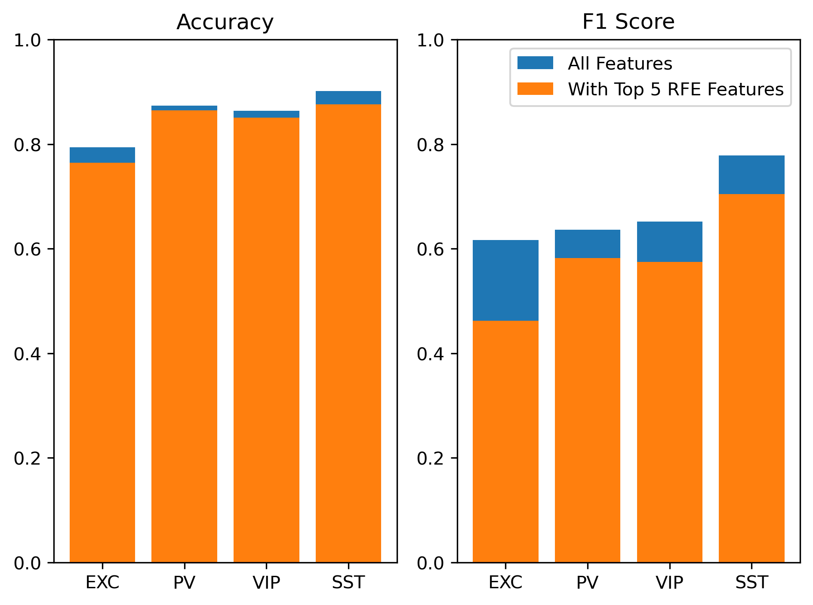

# Mouse Membrane Potential Active Whisking and Touch Decoding
> This study uses data from [@kiritani2023membrane](https://journals.plos.org/plosone/article?id=10.1371/journal.pone.0287174) to investigate which cell types might be better discriminators for active touch decoding in mouse barrel cortex during active whisker sensing

# Contents
* [Introduction](#Introduction)
* [Models and Methods](#Models-and-Methods)
  * [Preprocessing](#Preprocessing)
  * [Feature Extraction](#Feature-Extraction)
  * [Classification Model](#Classification-Model)
  * [Feature Importance Measures](#Feature-Importance-Measures)
* [Results](#Results)
  * [Classification by cell type](#Classification-by-cell-type)
    * [Correlation feature selection](#Correlation-feature-selection)
    * [Permutation feature selection](#Permutation-feature-selection)
    * [RFE feature selection](#RFE-feature-selection)
  * [Classification per single cell](#Classification-per-single-cell)
    * [Layer and Barrel dependence](#Layer-and-Barrel-dependence)
* [Conclusion](#Conclusion)

# Introduction

This research project seeks to investigate the potential for
distinguishing between two states in mouse behavior within a specific
cell type: free whisking (FW), characterized by unrestricted movement of
the mouse’s whiskers, and active touch (AT), where the whiskers make
contact with a metal pole. The classification process will be based
solely on features derived from membrane potentials. The underlying
hypothesis proposes that utilizing distinctions in membrane potentials
during these states can aid in decoding the mouse’s behavioral state (FW
or AT) within a specified time frame. In a parallel analogy to fMRI
decoding, where researchers decode brain activity from images, our
project employs a similar principle in decoding mouse behavior. In fMRI
studies, neural responses are decoded from brain images, providing
insights into cognitive processes. Similarly, in our investigation, we
traverse from the recording of membrane potentials (Vm) in specific
mouse cells to discerning the corresponding stimuli—specifically,
distinguishing between active touch (AT) and free whisking (FW) states.
By drawing this parallel, we highlight the common thread of decoding
complex information from neural recordings, whether it be unraveling
cognitive patterns in the human brain or discriminating between distinct
behaviors in mice based on their membrane potentials.

In the subsequent phase of the study, rather than developing a model for
each cell type, a model will be trained for each individual cell. The
objective is to see whether particular cells, given the considerable
variability in cell behavior, exhibit different accuracies than the
rest. Additionally, an analysis will be conducted to investigate whether
cells demonstrating different accuracies are localized at specific
depths or anatomical regions within the cortex.

# Models and Methods

## Preprocessing

In the initial phase of our study, we first extracted event windows from
$V_m$ for both active touch (AT) and free whisking peak (FW)
occurrences. All windows maintained a consistent duration of $0.5$
seconds, spanning from $-0.25$ seconds to $+0.25$ seconds from the peak
event. We only extracted the windows from peaks whose corresponding
window did not overlap with other peaks’ windows. For this, we had to
first understand what the given code does line by line and later
significantly change it so as to tailor it to our needs. The terms
*Trial* or *Sweep* are employed to indicate a singular recording of the
membrane potential (Vm) of a cell, while the terms *Event* or *Window*
are utilized to characterize the temporal window in $V_m$ surrounding
whisking events for both active touch (AT) and free whisking peaks (FW).

In summary, the code systematically traversed the time series of whisker
angles, identified time points where the peaks of whisking angles
exceeded a predetermined threshold, and ensured appropriate temporal
spacing between those occurrences. Subsequently, upon pinpointing the
temporal locations of these events, equivalent time windows were
extracted from the $V_m$ time series. Fig.
<a href="#window" data-reference-type="ref"
data-reference="window">21</a> shows this process step by step for free
whisking events. The time points for active touch events were already
present in the dataset, thus, no further processing was needed for them
<a href="#AT" data-reference-type="ref" data-reference="AT">10</a>. It
is noteworthy that our dataset comprised 4909 free whisking events and
1736 active touch events, displaying an imbalance between the two
classes. Consequently, the F1 score, in addition to accuracy, was
considered as the most appropriate metrics for gauging the accuracy of
our decoding model.

<figure id="window">

<figcaption>From left to right: 1) The whisking period of the mouse is
highlighted on the whisker angle signal. 2) Example peaks are extracted
from the whisking angle signal 3) The corresponding window around each
peak is extracted from <em>V</em><em>m</em> (after
removing the action potentials)</figcaption>
</figure>

<figure id="AT">

<figcaption>Active touch events highlighted on the whisker angle
signal</figcaption>
</figure>

## Feature Extraction

Our approach involved the extraction of features specific to each
window, yielding a total of 19 features. Given the lack of prior
knowledge regarding the significance of individual features in relation
to classification, we opted to start with a comprehensive set of
features and later on find those that are correlated with each other or
exhibit more importance than the rest. While certain features were
derived from the original dataset, we also integrated a lot of
additional features into the analysis for a more comprehensive
examination. The list of the features and their descriptions are show in
Table <a href="#tab:features" data-reference-type="ref"
data-reference="tab:features">1</a>

|    **Abbreviation**    |                            **Description**                            |
|:----------------------:|:---------------------------------------------------------------------:|
| vm_amplitude(pre/post) |            Mean Sub-threshold Membrane Potential Amplitude            |
|    ap_fr(pre/post),    | Mean Action Potential Firing Rate of Sub-threshold Membrane Potential |
|   fft_low(low/high)    |      Fast Fourier Transform of Sub-threshold Membrane Potential       |
|    vm_mav(pre/post)    |        Mean Absolute Value of Sub-threshold Membrane Potential        |
|    vm_max(pre/post)    |           Maximum Value of Sub-threshold Membrane Potential           |
|    vm_std(pre/post)    |        Standard Deviation of Sub-threshold Membrane Potential         |
|    vm_rms(pre/post)    |         Root Mean Squared of Sub-threshold Membrane Potential         |
|    vm_wl(pre/post)     | Wave Length or Geodesic Distance of Sub-threshold Membrane Potential  |
|    vm_ssc(pre/post)    |         Slope Sign Change of Sub-threshold Membrane Potential         |
|       Cell_Depth       |                           Depth of the cell                           |

List of the extracted features. pre/post means that the feature was
extracted two times one for the pre-onset window and one for the
post-onset window

## Classification Model

The classification was performed using Support Vector Machine (SVM)
algorithm, which is a powerful-supervised machine learning algorithm
commonly used in classification problems with two or more classes. The
goal of the SVC algorithm is to find the hyperplane that best separates
the classes in the transformed space. As implantation was used the
package of Scikitlearn. In order to improve the model, a Grid Search
approach was performed to find the best set of hyperparameters that
elicit a high level of accuracy. The parameter grid includes values for
the regularization parameter ’C’ \[0.1, 1, 10, 100, 1000\], kernel
function \[’poly’, ’rbf’ (Radial Basis Function), ’sigmoid’\], and
kernel coefficient ’gamma’ \[0.001, 0.01, 0.1, 1, 10, ’auto’\].

To better test our model and effectively use the whole dataset for model
evaluation, we used nested-cross-validation that combines hyperparameter
tuning with cross-validation and consists of an inner and outer loop. As
illustrated in Fig.
<a href="#nested-cross-val" data-reference-type="ref"
data-reference="nested-cross-val">11</a> , during the inner loop,
hyperparameter tuning is conducted by training models on the training
data and validating them on a separate validation set. The objective is
to identify the optimal parameters, and the model is then trained on the
entire inner loop dataset. Despite being optimized for performance on
the validation data, there is potential bias in the evaluation. To
mitigate this, in an outer loop, the model undergoes testing using a
separate test dataset, aiming to provide an unbiased performance
estimate. Once the expected performance is known, the model needs to be
trained using all available data. It’s crucial to recognize that our
model comprises not only the algorithm, but the entire process of
building the model.

<figure id="nested-cross-val">

<figcaption>Image by by Ajitesh Kumar in Nested Cross Validation for
Algorithm Selection, August 31, 2020</figcaption>
</figure>

## Feature Importance Measures

Feature selection and feature importance ranking refers to the process
of selecting a subset of variables from a dataset for use in the machine
learning algorithms. In some cases, it may be necessary to reduce the
number of features in order to improve model performance, prevent
overfitting, or make the training process less computationally
intensive. Feature importance ranking can also help with data
visualization by reducing the dimensionality of a dataset. This makes it
easier to understand relationships between variables and identify their
interactions. Here we decided to use three measure of feature selection:

- Correlation Based: Correlation feature reduction involves identifying
  and eliminating groups of correlated features in a dataset. In this
  process, highly correlated features are identified, and one or more
  features from each correlated group are kept to reduce redundancy. The
  goal is to retain the most informative features while eliminating
  those that provide similar information, as highly correlated features
  can introduce multicollinearity issues and may not contribute
  significantly to the model’s predictive power. By reducing correlated
  features, this technique aims to enhance model interpretability,
  mitigate overfitting, and potentially improve the efficiency of the
  learning algorithm.

- Permutation Feature Importance: Permutation feature importance serves
  as a method for inspecting machine learning models applied to tabular
  data, particularly proving valuable for non-linear or less transparent
  estimators. The concept revolves around assessing the impact on a
  model’s score when randomly shuffling a single feature’s values. This
  shuffling disrupts the connection between the feature and the target
  variable, and the ensuing drop in the model score indicates the extent
  to which the model relies on that specific feature. An advantage of
  this technique is its model-agnostic nature, allowing for multiple
  calculations with diverse permutations of the feature. It is crucial
  to note that features deemed unimportant for an underperforming model
  might hold significant importance for a well-performing one. Hence,
  evaluating a model’s predictive capability with a separate set or,
  better yet, through cross-validation is essential before determining
  feature importances. Permutation importance reflects the feature’s
  importance within the context of a specific model rather than its
  intrinsic predictive value in isolation.

- Recursive Feature Elimination (RFE): RFE is a feature selection
  technique commonly used in machine learning. It systematically ranks
  and eliminates features based on their importance to the model’s
  performance. The process starts with the entire set of features and
  recursively removes the least significant ones, typically using a
  model-specific metric, until the desired number of features is
  reached. At each iteration, the model is retrained, and the feature
  rankings are reassessed. RFE helps identify the most informative
  features for a given task, contributing to enhanced model
  interpretability and potentially improving predictive performance by
  focusing on the most relevant attributes.

# Results

## Classification by cell type

Figure <a href="#cell_type_acc_all_feat" data-reference-type="ref"
data-reference="cell_type_acc_all_feat">12</a> shows the result of
performing the decoding model on each cell type to predict the label
(free whisking peak or active touch). EXC cells had an accuracy of 0.79
and F1 score of 0.61, PV cells had an accuracy of 0.87 and F1 score of
0.63, VIP cells had an accuracy of 0.86 and an F1 score of 0.65, and SST
cells had an accuracy of 0.90 and F1 score of 0.77. SST cells exhibit
the highest accuracy and F1 score, whereas, excitatory cells showed the
worst outcome. we might be able to attribute this to excitatory cells
showing less distinction and have less discernible features between the
two states of free whisking peak and active touch. Whereas as we saw in
question three SST cells show depolarization for AT and
hyperpolarization for FW which could be picked up by the machine
learning model leading to higher accuracy.

<figure id="cell_type_acc_all_feat">

<figcaption aria-hidden="true"></figcaption>
</figure>

Following the initial classification, an extensive examination of
feature importance was conducted using the techniques discussed in the
previous section.

### Correlation feature selection

The initial strategy to reduce the number of features involved assessing
their correlation levels. Within each cluster of correlated features, we
retained a single feature, which was then used for classification.
Figure <a href="#corr_feat_groups" data-reference-type="ref"
data-reference="corr_feat_groups">13</a> illustrates how different cell
types exhibit distinct sets of correlated features. Here we list the
correlated groups for each cell type.

- EXC:

  - vm_amplitude_post, vm_amplitude_pre, vm_mav_post, vm_mav_pre,
    vm_max_post, vm_max_pre, vm_rms_post, vm_rms_pre

  - vm_wl_post, vm_wl_pre

  - vm_ssc_post, vm_ssc_pre

- PV:

  - vm_amplitude_pre, vm_mav_pre, vm_max_pre, vm_rms_pre, vm_std_pre

  - vm_amplitude_post, vm_mav_post, vm_max_post, vm_rms_post

  - vm_wl_post, vm_wl_pre

- VIP:

  - vm_amplitude_pre, vm_mav_pre, vm_max_pre, vm_rms_pre

  - vm_amplitude_post, vm_mav_post, vm_max_post, vm_rms_post

  - vm_wl_post, vm_wl_pre

  - vm_ssc_post, vm_ssc_pre

- SST:

  - vm_amplitude_post, vm_amplitude_pre, vm_mav_post, vm_mav_pre,
    vm_max_post, vm_max_pre, vm_rms_post, vm_rms_pre

  - vm_wl_post, vm_wl_pre

We observe that both EXC and SST cells exhibit a substantial cluster
with 8 correlated features each. Additionally, the initial two clusters
associated with PV and VIP cells originate from either the pre or post
window, suggesting that correlated features tend to be situated on the
same side of the onset for these cell types.

Upon removal of correlated features, a marginal reduction in the
accuracy of the model is observed in Fig.
<a href="#acc_model_less_corr_feat" data-reference-type="ref"
data-reference="acc_model_less_corr_feat">14</a>. PV cells demonstrate
the least amount of change, suggesting an abundance of redundant
features within this cell type. In contrast, both EXC and VIP cells
exhibit substantial change, with the greatest impact on their accuracy
and particularly a decrease in F1 score. This observed variation
underscores the distinct characteristics of these cell types in terms of
feature correlation. It is worth noting that certain widely used
correlation filtering methods tend to eliminate more features than
necessary, a concern that becomes more pronounced in larger datasets
with numerous pairwise correlations surpassing a specified threshold.
This feature removal may result in a loss of information, potentially
leading to suboptimal model performance.

<figure id="corr_feat_groups">

<figcaption>Correlation matrices for each cell type</figcaption>
</figure>

<figure id="acc_model_less_corr_feat">

<figcaption>Accuracy and F1 score before and after correlated feature
removal </figcaption>
</figure>

### Permutation feature selection

Next, we conducted permutation feature importance analysis. Fig
<a href="#acc_model_less_permutation_feat" data-reference-type="ref"
data-reference="acc_model_less_permutation_feat">15</a> shows the result
of training the model on the dataset with correlated features removed
(blue bar) versus training it with only the top five features based on
their scores (orange bar). It is crucial to acknowledge that in
permutation feature importance, when two features are correlated, and
one undergoes permutation, the model can still access the feature
through its correlated counterpart. This scenario leads to diminished
importance values for both features, potentially masking their actual
significance. To mitigate this issue, we applied the permutation feature
selection (PFS) method directly to the uncorrelated features obtained in
the previous step.

It is evident that SST and PV cells exhibit minimal changes, while EXC
and VIP cells experience a more significant reduction in their F1 score,
indicating that the model gets more biased toward a specific class.
Importantly, these observations come after eliminating correlated
features. When accuracy remains consistent in this context, it signifies
that the method effectively identified crucial features and successfully
eliminated unnecessary ones that simple correlation could not discern.

<figure id="acc_model_less_permutation_feat">

<figcaption>Blue bar: metric with all the uncorrelated features, Orange
var: metric with only the top 5 features based on permutation feature
importance</figcaption>
</figure>

In Figure
<a href="#fig:permutation_feat_table" data-reference-type="ref"
data-reference="fig:permutation_feat_table">16</a>, we observe the top
five features for various cell types using the permutation feature
method. AP firing rate is the most important feature for PV cells which
matches our observations in part 3. Fast Fourier transform ranks as the
top feature for EXC cells and slope sign change seems to be important
for SST cells. AP firing rate and the amplitude of action potential in
the post window are consequential for VIP cells. The figure not only
presents the selected features but also provides insights into their
respective rankings across different cells. It is essential to note that
Permutation Feature Selection (PFS) doesn’t inherently convey the
predictive value of a feature in isolation. Instead, it emphasizes the
significance of a feature within a specific model. Figure
<a href="#permutation_feat_hist" data-reference-type="ref"
data-reference="permutation_feat_hist">17</a> shows the ranking of the
feature across all cell types and signifies that AP firing rate in the
post onset windows and slope sign change seem to be the most important
ones in general.

<figure id="fig:permutation_feat_table">

<figcaption>Feature rankings for each cell types</figcaption>
</figure>

<figure id="permutation_feat_hist">

<figcaption>Feature rankings across all cell types</figcaption>
</figure>

### RFE feature selection

In this section, we opt for Recursive Feature Elimination (RFE) as it
enables the utilization of all features without necessitating the
removal of correlated ones, allowing for a more comprehensive
understanding of complex interactions between features. As seen in Fig.
<a href="#acc_model_less_RFE_feat" data-reference-type="ref"
data-reference="acc_model_less_RFE_feat">18</a>, EXC and SST cells
exhibit the most significant changes in their metric after training the
model only on the top 5 features. Fig.
<a href="#RFE_feat_table" data-reference-type="ref"
data-reference="RFE_feat_table">19</a> represents the top 5 features for
each cell type, and Fig.
<a href="#RFE_feat_hist" data-reference-type="ref"
data-reference="RFE_feat_hist">20</a> represents the ranking of the
feature based on their importance across the cell types. Unlike
Permutation Feature Importance (PFI), Fast Fourier Transform appears to
have a comparatively lesser impact. Once again, it is evident that
action potential firing rate holds utmost importance for PV cells.
Across all cell types, features such as wave length and slope sign
change consistently emerge as the most crucial.

<figure id="acc_model_less_RFE_feat">

<figcaption>Metric for RFE feature reduction. The blue bar represents
the metric using all 19 features.</figcaption>
</figure>

<figure id="RFE_feat_table">

<figcaption>Top 5 features for each cell type based on RFE</figcaption>
</figure>

<figure id="RFE_feat_hist">

<figcaption>Feature rankings across cell types based on RFE</figcaption>
</figure>

## Classification per single cell

Given the considerable variation in behavior and characteristics (Fig.
<a href="#fig:part2-ap_duration" data-reference-type="ref"
data-reference="fig:part2-ap_duration">[fig:part2-ap_duration]</a>)
observed among individual cells, including those within the same cell
type, we tried a subsequent iteration of classification by training the
model on individual cells. The aim of this exploration was to ascertain
whether certain cells could achieve different accuracies from others and
if so, what are some of their distinct features.

<figure id="window">

<figcaption>AP duration across different class of cells: we can see a
lot of variability in each class</figcaption>
</figure>

In order to mitigate bias and overfitting to a specific class and
guarantee the acquisition of significant outcomes, a threshold was
applied in the selection of cells for this section. Specifically, only
cells demonstrating a well-balanced and sufficiently high count (more
than 15) of active touch (AT) and free whisking (FW) events were
included in the analysis. After this thorough screening process, a
subset of 25 cells was identified from the larger dataset, which
initially comprised 205 cells. Table
<a href="#tab:example" data-reference-type="ref"
data-reference="tab:example">2</a> shows the cell types and their count
in this subset.

| **Cell Type** | **Number of Cells** |
|:-------------:|:-------------------:|
|      EXC      |          9          |
|      PV       |          3          |
|      VIP      |          1          |
|      SST      |         12          |

Subset of cells selected

For each of the selected cells, an independent classifier was trained
using the relevant data specific to each cell. The training process
encompassed initial classification employing all available features,
followed by a feature selection step using RFE, mirroring the
methodology outlined in the preceding sections. As depicted in Fig.
<a href="#acc_single_cell_RFE" data-reference-type="ref"
data-reference="acc_single_cell_RFE">22</a>, noticeable shifts in
accuracy and F1 score emerge after feature pruning across different
cells. Interestingly, certain cells exhibit an improvement in metrics,
while others show a decline. The variability among distinct cells shows
the unique impact of feature reduction on accuracy for each individual
cell. This divergent behavior aligns with the typical patterns observed
in machine learning models, where reducing the number of features can
enhance accuracy by prioritizing essential information. However, it also
carries the risk of losing valuable information, potentially leading to
decreased accuracy.

<figure id="acc_single_cell_RFE">

<figcaption>Accuracy and F1 score for each cell</figcaption>
</figure>

An interesting observation stands out in the behavior of cell TK471_1,
where both accuracy and F1 score remain very high even after feature
selection. To understand why this high accuracy is achieved, a careful
analysis of the feature space within the windows (AT and FW) of the cell
was conducted. The pairplot (Fig
<a href="#why_acc_1" data-reference-type="ref"
data-reference="why_acc_1">23</a>) shows the values of the most crucial
features for cell TK471_1 across the two labels. Notably, the feature
vm_ssc_post effectively distinguishes between the two distinct states.
Based on these findings, it can be concluded that the classifier trained
on these cells achieves outstanding performance by effectively using the
discriminative power of this particular feature.

<figure id="why_acc_1">

<figcaption>Pair plot for two of the features of TK471_1</figcaption>
</figure>

### Layer and Barrel dependence

Our final investigation aimed to see if cells with high accuracy in the
classification task are found in specific areas of the primate sensory
barrel cortex, focusing on layer location (L3/4, L5, etc.) and the
barrel’s anatomical region (C2, S1, etc.). We hypothesized that, after
stimulating the C2 whisker, the most activated cells would be in the C2
barrel, suggesting that cells with higher accuracy would mostly be
located there. ig. <a href="#by_layer" data-reference-type="ref"
data-reference="by_layer">24</a> breaks down the accuracy by cell layer,
while Fig. <a href="#by_barrel" data-reference-type="ref"
data-reference="by_barrel">[by_barrel]</a> shows accuracy based on
anatomical regions. However, we couldn’t provide a statistically
significant answer to our inquiry because of some limitations of the
dataset since only one cell was not in the C2 barrel and as for the cell
layer, there weren’t enough cells to draw significant conclusions, with
over half of the dataset lacking cell layer information. Given these
constraints, we cannot definitively determine if specific cell locations
correlate with superior classification capabilities.

<figure id="by_layer">

<figcaption>F1 score of different cells differentiated by their
layer</figcaption>
</figure>

## Conclusion

In summary, our exploration into mouse behavior within the primate
sensory barrel cortex by employing machine learning techniques, has
yielded promising results. The models demonstrated commendable accuracy
and F1 scores, emphasizing the efficacy of these approaches in decoding
intricate behavioral patterns. Interestingly, SST cells exhibited the
highest accuracy, providing valuable insights into their distinctive
behavior, while excitatory (EXC) cells showed comparatively lower
accuracy.

We outlined which feature are most important for each cell types, and
notably, even after feature removal, the models maintained relatively
high accuracies, highlighting the robustness of the model and the
resilience of the remaining features. This underscores the adaptability
and effectiveness of the model in decoding mouse behavior within the
sensory barrel cortex. While challenges remain, our findings contribute
to the ongoing understanding of cellular behavior and pave the way for
further investigations in neuroscience and behavior analysis.

Our investigation into single cell classification revealed significant
variability in accuracy among cells, underscoring the importance of
individual cellular characteristics. However, limitations in data
availability hindered our ability to establish conclusive correlations
between cell attributes and their spatial origin, such as C2 barrel,
layer location, and anatomical region.

